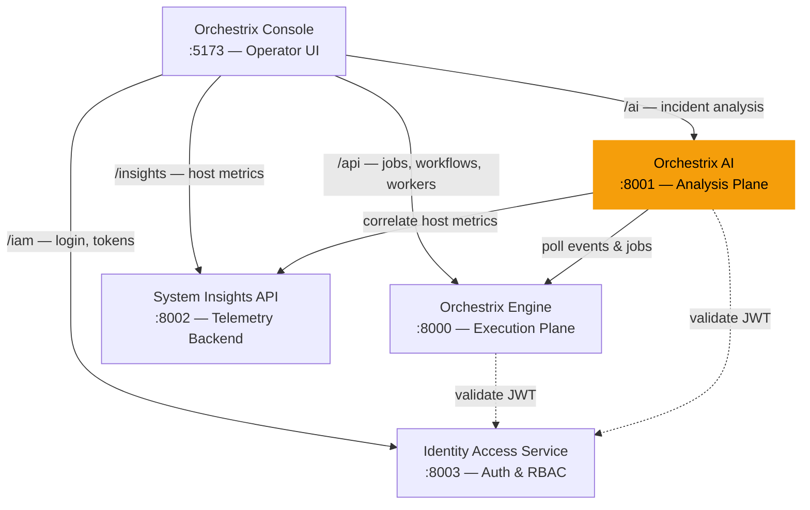

# 🧠 Orchestrix AI

**The analysis plane of the [Orchestrix Platform](#platform-architecture).** Consumes job lifecycle events from Engine and host metrics from Insights. Emits structured incident analysis, anomaly detection, prioritization, and real-time system health — displayed by Console.

Production-style AI reasoning engine for analyzing distributed system incidents — not a chatbot, an automated debugging pipeline. Correlates signals across events, jobs, metrics, and alerts. Classifies incidents. Explains root causes with a reasoning trace. Falls back to deterministic rules when the LLM is unavailable.

---

## 🔥 Why This Is Different

Most AI projects generate text.

Orchestrix AI **behaves like a system engineer**:

- **Correlates** cross-source signals deterministically (before LLM)
- **Classifies** incident types automatically (6 categories)
- **Reasons** with an explicit step-by-step chain
- **Scores quality** — confidence, signal strength, data coverage
- **Falls back** to rule-based analysis when LLM is unreachable
- **Caches** results to avoid redundant LLM calls
- **Versions** prompts for reproducibility

This is an **AI-powered debugging engine** for real systems.

---

## 🔗 Part of the Orchestrix Platform

Orchestrix AI is the **analysis plane** of the Orchestrix Platform — it ingests execution data and system telemetry, then produces structured incident analysis, anomaly detection, and root-cause explanations.

| Service | Role | Interaction |
|---------|------|-------------|
| **[Orchestrix Engine](https://github.com/Yogevso/Orchestrix-Engine)** | Execution plane | AI polls Engine events and job data to detect failure patterns and generate incident analysis |
| **[Orchestrix Console](https://github.com/Yogevso/orchestrix-console)** | Operator UI | Console calls AI endpoints and displays root-cause analysis, reasoning traces, and recommendations |
| **[System Insights API](https://github.com/Yogevso/system-insights-api)** | Telemetry backend | AI correlates host/service metrics with Engine execution failures (e.g. CPU spike → job failure) |
| **[Identity Access Service](https://github.com/Yogevso/identity-access-service)** | Shared auth | AI validates JWT tokens for tenant-scoped access to privileged analysis endpoints |

**Data AI consumes:**
- Job lifecycle events and workflow failures from Engine (`GET /events`, `GET /jobs`)
- Host metrics, process data, and alerts from System Insights API
- Custom telemetry snapshots via replay mode

**Data AI produces:**
- Incident classification and root-cause analysis
- Reasoning traces with quality scores (confidence, signal strength, data coverage)
- Anomaly detection results (threshold + z-score)
- Prioritized incident rankings
- Real-time system health via SSE stream

### Data Flow

```
Orchestrix Engine  →  job/workflow events
System Insights API  →  host metrics, alerts
         ↓
    Orchestrix AI  →  correlate, classify, reason
         ↓
   Orchestrix Console  →  display insights to operator
```

### Platform Architecture



---

## ✨ Features

| Capability | Endpoint | Description |
|---|---|---|
| **Incident Analyzer** | `POST /ai/analyze-incident` | Correlates events/jobs/metrics/alerts, classifies the incident, produces root cause analysis with reasoning trace, quality score, and timeline |
| **Correlation Engine** | *(internal)* | Deterministic cross-source pattern detection (deployment→error, CPU→job failure, memory→OOM, cascading) runs **before** LLM |
| **Rule-Based Fallback** | *(internal)* | Full rule-based analysis when LLM is unavailable — classifies incidents, generates timelines, recommends actions |
| **Anomaly Detection** | `POST /ai/detect-anomalies` | Threshold-based and z-score anomaly detection over system metrics |
| **RAG Search** | `POST /ai/search` | Keyword-based retrieval over system telemetry — filters relevant context and generates LLM-powered answers |
| **Prioritization Engine** | `POST /ai/prioritize` | Ranks incidents, events, and alerts by severity and impact with reasoning |
| **Live Monitoring** | `GET /ai/live` | Real-time SSE stream of system status snapshots (critical items, counts, health) |
| **Replay / Debug Mode** | `POST /ai/replay-incident` | Submit custom telemetry for reproducible incident debugging |
| **Batch Analysis** | `POST /ai/analyze-batch` | Analyze up to 20 incidents in a single request |
| **TTL Caching** | *(internal)* | In-memory result cache avoids redundant LLM calls (5-min TTL) |
| **Quality Scoring** | *(response field)* | Every response includes `confidence`, `signal_strength`, and `data_coverage` |
| **Prompt Versioning** | *(response field)* | Every response tagged with the prompt version that produced it |

---

## 🏗️ Architecture

```
            ┌─────────────────────────────────┐
            │       FastAPI Endpoints          │
            │  analyze / search / anomalies    │
            │  prioritize / live / replay      │
            │  batch                           │
            └──────────────┬──────────────────┘
                           │
                           ▼
            ┌─────────────────────────────────┐
            │       Analyzer Service           │
            │   (orchestrator + cache layer)    │
            └──┬───────┬──────┬───────┬───────┘
               │       │      │       │
       ┌───────┘       │      │       └──────┐
       ▼               ▼      ▼              ▼
┌────────────┐ ┌────────────┐ ┌──────────┐ ┌──────────────┐
│ Tool Layer │ │ Correlation│ │   RAG    │ │ LLM Service  │
│ (MCP-lite) │ │  Engine    │ │ Retriever│ │ (+ fallback) │
└────────────┘ └────────────┘ └──────────┘ └──────────────┘
  get_events()   deploy→error   keyword      OpenAI API
  get_jobs()     cpu→job_fail   filtering    rule-based
  get_metrics()  memory→oom                  fallback
  get_alerts()   cascading
       │
       ▼
┌────────────────────┐
│ Orchestrix Backend  │  (live API)
│  /events  /jobs     │
│  /alerts  /metrics  │
└────────────────────┘
```

**Pipeline for each analysis:**

```
Tool calls → Correlator (deterministic) → RAG context → LLM (or fallback) → QualityScore → Cached response
```

- **Tool Layer** — queries the Orchestrix backend API for live telemetry. Falls back to mock data when backend is unavailable.
- **Correlation Engine** — deterministic cross-source pattern detection **before** the LLM. Finds deployment→error chains, CPU→job failures, memory→OOM, and cascading failure patterns.
- **RAG Retriever** — filters retrieved data by keyword relevance. Designed for future upgrade to vector search.
- **LLM Service** — sends enriched context (including pre-computed correlations) to OpenAI with `response_format=json_object`. Falls back to a full rule-based analysis engine when unavailable.
- **Analyzer Service** — orchestrates the pipeline, manages TTL cache, computes quality scores, handles replay and batch modes.

---

## 🔄 Example Flow

1. **SysWatch** detects a CPU spike on a worker node
2. The event is stored in **Orchestrix Backend** (`POST /events`)
3. **Orchestrix AI** retrieves related events, jobs, metrics, and alerts
4. **Correlation engine** links the CPU spike → failed jobs → deployment event
5. **LLM** generates structured root cause analysis with reasoning trace
6. Result is cached and returned with a **quality score**
7. **Orchestrix Console** displays the timeline, root cause, and recommended action

---

## 🧠 How It Thinks

Orchestrix AI follows a **hybrid reasoning pipeline** — deterministic first, AI second:

1. **Retrieve** telemetry via tool functions (`get_events`, `get_jobs`, `get_metrics`, `get_alerts`)
2. **Correlate** signals deterministically (deployment→error, CPU→job failure, memory→OOM, cascading)
3. **Score** data coverage and signal strength before sending to LLM
4. **Build** structured context including pre-computed correlations
5. **Reason** with LLM — or **fall back** to rule-based analysis if LLM is unavailable
6. **Validate** output through Pydantic schemas
7. **Cache** result with TTL to avoid redundant calls

This ensures:
- **Explainability** — every response has a reasoning chain and quality score
- **Resilience** — works without LLM via rule-based fallback
- **Consistency** — validated schemas, not free-form text
- **Efficiency** — cached results, batched analysis

---

## 🧠 Before vs After

### Without Orchestrix AI
- Check logs manually across multiple services
- Inspect metrics dashboards for anomalies
- Correlate events across time windows by hand
- Guess the root cause
- No confidence score — just intuition

### With Orchestrix AI
- **One API call** → full incident analysis with classification
- **Structured explanation** with root cause, reasoning trace, and quality score
- **Automatic correlation** of cross-source signals before LLM even runs
- **Timeline** of events leading to the incident
- **Suggested fix** based on system patterns
- **Works offline** — rule-based fallback when LLM is down

> Reduces debugging time from **minutes/hours** to **seconds**.

---

## 📁 Project Structure

```
orchestrix-ai/
├── app/
│   ├── main.py                 # FastAPI application, middleware, router registration
│   ├── config.py               # Settings via pydantic-settings (.env)
│   ├── dependencies.py         # FastAPI DI — singleton service, API key auth
│   ├── api/
│   │   ├── analyze.py          # POST /ai/analyze-incident
│   │   ├── search.py           # POST /ai/search
│   │   ├── anomalies.py        # POST /ai/detect-anomalies
│   │   ├── prioritize.py       # POST /ai/prioritize
│   │   ├── live.py             # GET  /ai/live (SSE stream)
│   │   ├── replay.py           # POST /ai/replay-incident
│   │   └── batch.py            # POST /ai/analyze-batch
│   ├── services/
│   │   ├── analyzer.py         # Core orchestration + cache + fallback
│   │   ├── correlator.py       # Deterministic cross-source correlation engine
│   │   ├── cache.py            # TTL-based in-memory result cache
│   │   ├── llm.py              # OpenAI client & prompt engineering
│   │   ├── tools.py            # MCP-lite tool functions (data retrieval)
│   │   └── rag.py              # RAG retrieval & filtering layer
│   └── schemas/
│       └── models.py           # Pydantic models (QualityScore, Correlation, etc.)
├── tests/
│   ├── test_api.py             # API endpoint tests (9 tests)
│   ├── test_correlator.py      # Correlation engine tests (5 tests)
│   ├── test_cache.py           # TTL cache tests (6 tests)
│   ├── test_schemas.py         # Schema validation tests (3 tests)
│   ├── test_tools.py           # Tool layer tests (4 tests)
│   └── test_rag.py             # RAG retriever tests (2 tests)
├── requirements.txt
├── pyproject.toml
├── .env.example
└── LICENSE
```

---

## 🚀 Getting Started

### Prerequisites

- Python 3.12+
- An [OpenAI API key](https://platform.openai.com/api-keys)

### Installation

```bash
git clone https://github.com/Yogevso/orchestrix-ai.git
cd orchestrix-ai

python -m venv .venv
# Windows
.\.venv\Scripts\activate
# macOS/Linux
source .venv/bin/activate

pip install -r requirements.txt
```

### Configuration

```bash
cp .env.example .env
```

Edit `.env` and set your API key:

```env
OPENAI_API_KEY=sk-your-key-here
LLM_MODEL=gpt-4o
ORCHESTRIX_API_URL=http://localhost:8000
LOG_LEVEL=INFO
API_KEY=              # Optional — set to require X-API-Key header
MAX_REQUEST_BODY_KB=512
```

### Run the Server

```bash
uvicorn app.main:app --reload
```

The API is available at `http://localhost:8000`. Interactive docs at `http://localhost:8000/docs`.

---

## 📡 API Reference

### Health Check

```
GET /health
→ { "status": "ok" }
```

### Analyze Incident

```bash
curl -X POST http://localhost:8000/ai/analyze-incident \
  -H "Content-Type: application/json" \
  -d '{"incident_id": "123", "time_range": "last_10_minutes"}'
```

**Response:**

```json
{
  "incident_id": "123",
  "incident_type": "deployment_issue",
  "summary": "Worker pod OOMKilled after deployment, causing cascading failures",
  "root_cause": "Memory limit exceeded in orchestrix-worker after v2.4.1 rollout",
  "reasoning_steps": [
    "Detected deployment event for orchestrix-worker v2.4.1",
    "Found OOMKilled error 3 minutes after deployment",
    "Correlated with memory usage alert exceeding 90% threshold",
    "Identified container restart loop (attempt 3/5)",
    "Concluded: new version introduced memory regression"
  ],
  "correlations": [
    {
      "sources": ["orchestrix-worker", "prometheus"],
      "pattern": "Deployment event followed by errors — possible bad rollout",
      "severity": "critical"
    }
  ],
  "timeline": [
    { "timestamp": "2026-04-03T10:00:00Z", "event": "Deployment rolled out", "severity": "info" },
    { "timestamp": "2026-04-03T10:03:00Z", "event": "OOMKilled", "severity": "critical" },
    { "timestamp": "2026-04-03T10:05:00Z", "event": "Container restarted", "severity": "warning" }
  ],
  "recommended_action": "Increase memory limit to 1Gi or investigate memory leak in v2.4.1",
  "quality": {
    "confidence": 0.87,
    "signal_strength": 0.9,
    "data_coverage": 1.0
  },
  "source": "ai",
  "prompt_version": "v1.2"
}
```

### RAG Search

```bash
curl -X POST http://localhost:8000/ai/search \
  -H "Content-Type: application/json" \
  -d '{"query": "failed jobs with high CPU"}'
```

**Response:**

```json
{
  "query": "failed jobs with high CPU",
  "answer": "Two jobs failed in the last 10 minutes...",
  "sources": [
    { "content": "job-042 data-pipeline-sync failed", "source": "tools/jobs", "relevance": 0.9 }
  ]
}
```

### Detect Anomalies

```bash
curl -X POST http://localhost:8000/ai/detect-anomalies \
  -H "Content-Type: application/json" \
  -d '{"time_range": "last_10_minutes", "anomaly_type": "threshold"}'
```

**Response:**

```json
{
  "anomalies": [
    {
      "metric": "memory_usage_percent",
      "value": 93.0,
      "threshold": 90.0,
      "severity": "critical",
      "description": "Memory usage exceeded 90% on orchestrix-worker-7f8b4"
    }
  ],
  "summary": "1 critical anomaly detected: memory pressure on worker pod"
}
```

### Prioritize

```bash
curl -X POST http://localhost:8000/ai/prioritize \
  -H "Content-Type: application/json" \
  -d '{"time_range": "last_10_minutes"}'
```

**Response:**

```json
{
  "ranked_items": [
    { "id": "evt-002", "type": "event", "title": "OOMKilled", "priority": 1, "reason": "Direct cause of service disruption" },
    { "id": "alert-101", "type": "alert", "title": "Memory > 90%", "priority": 2, "reason": "Correlated with OOM event" }
  ],
  "reasoning": "OOM event is the root cause; memory alert is the leading indicator..."
}
```

---
### Live Monitoring (SSE)

```bash
curl -N http://localhost:8000/ai/live
```

**Stream events:**

```
event: status
data: {"timestamp":"2026-04-03T10:15:00Z","status":"critical","counts":{"events":4,"failed_jobs":2,"alerts":2,"high_cpu":2},"critical_items":[{"type":"event","id":"evt-002","message":"OOMKilled: container exceeded 512Mi memory limit"}]}
```

Streams a system health snapshot every 5 seconds. Connect from the Console UI for real-time monitoring.

### Replay / Debug Mode

Submit custom telemetry data for reproducible incident debugging:

```bash
curl -X POST http://localhost:8000/ai/replay-incident \
  -H "Content-Type: application/json" \
  -d '{
    "events": [
      {"id": "e1", "timestamp": "2026-04-03T10:00:00Z", "type": "deployment", "source": "k8s", "message": "Deployed v2.4.1", "severity": "info"},
      {"id": "e2", "timestamp": "2026-04-03T10:03:00Z", "type": "error", "source": "worker", "message": "OOMKilled", "severity": "critical"}
    ],
    "jobs": [],
    "alerts": [
      {"id": "a1", "timestamp": "2026-04-03T10:02:00Z", "severity": "critical", "source": "prometheus", "message": "Memory > 90%", "metric": "container_memory_usage"}
    ],
    "metrics": []
  }'
```

Returns the same `AnalyzeIncidentResponse` as `/ai/analyze-incident`, but using **your supplied data** instead of live telemetry. Useful for debugging specific failure scenarios.

### Batch Analysis

Analyze up to 20 incidents in a single request:

```bash
curl -X POST http://localhost:8000/ai/analyze-batch \
  -H "Content-Type: application/json" \
  -d '{"incident_ids": ["inc-001", "inc-002", "inc-003"], "time_range": "last_10_minutes"}'
```

**Response:**

```json
{
  "results": [ ... ],
  "total": 3,
  "succeeded": 3,
  "failed": 0
}
```

---
## 🧪 Testing

```bash
pytest tests/ -v
```

**29 tests** covering:
- API endpoint validation (health, analyze, search, anomalies, prioritize, live, replay, batch)
- Correlation engine (deployment→error, CPU→job, memory→OOM, cascading, empty data)
- TTL cache (set/get, expiry, invalidate, clear, prune)
- Schema validation (full response, rule-based source, enum values)
- Tool layer (events, jobs, CPU metrics, alerts)
- RAG retriever (keyword matching, fallback)

All tests run without an OpenAI API key — the rule-based fallback handles no-LLM scenarios.

---

## 🗺️ Roadmap

| Phase | Status | Description |
|---|---|---|
| **Phase 1** — Foundation | ✅ Done | FastAPI app, LLM integration, structured output |
| **Phase 2** — Incident Analyzer | ✅ Done | Fetch events/jobs, LLM analysis, timeline generation |
| **Phase 3** — RAG + Tools | ✅ Done | Keyword-based retrieval, MCP-lite tool layer |
| **Phase 4** — All Endpoints | ✅ Done | Search, anomaly detection, prioritization, SSE live |
| **Phase 5** — Live Integration | ✅ Done | Real API calls to Orchestrix backend (with mock fallback) |
| **Phase 6** — Production Features | ✅ Done | Correlation engine, quality scoring, rule-based fallback, caching, replay mode, batch analysis, prompt versioning |
| **Future** | 🔲 | Vector search (FAISS), streaming responses, multi-model support, Redis cache |

---

## 🔮 Future AI Enhancements

- **Tool-calling agents** — OpenAI function calling for dynamic tool selection
- **Streaming reasoning** — real-time explanation generation via SSE
- **Feedback loop** — reinforcement signals from resolved incidents
- **Multi-model support** — Claude, Gemini, local models via LiteLLM
- **Vector search** — FAISS / SQLite-VSS for semantic RAG retrieval
- **Distributed cache** — Redis for multi-instance deployments

---

## 🎥 Demo

Coming soon — integration with [Orchestrix Console](https://github.com/Yogevso/orchestrix-console).

---

## ⚠️ Limitations

- Relies on the quality and completeness of input telemetry data
- Does not replace human debugging judgment — augments it
- Heuristic-based anomaly detection (threshold + z-score); ML-based planned for future
- RAG layer uses keyword filtering; vector search planned
- In-memory cache — not shared across instances (Redis upgrade planned)
- Rule-based fallback covers common patterns but won't match LLM reasoning depth

---

## 🛠️ Tech Stack

| Layer | Technology |
|---|---|
| Backend | Python, FastAPI |
| AI | OpenAI API (GPT-4o) + rule-based fallback |
| Auth | API key authentication (optional, via `X-API-Key` header) |
| Correlation | Deterministic cross-source pattern engine |
| RAG | Keyword filtering (MVP) → FAISS / SQLite-VSS |
| Caching | In-memory TTL cache → Redis |
| Streaming | SSE via sse-starlette (with disconnect cleanup) |
| Validation | Pydantic v2 |
| Config | pydantic-settings, python-dotenv |
| DI | FastAPI dependency injection (singleton services) |
| Testing | pytest (29 tests), httpx |

---

## 📄 License

[MIT](LICENSE)
